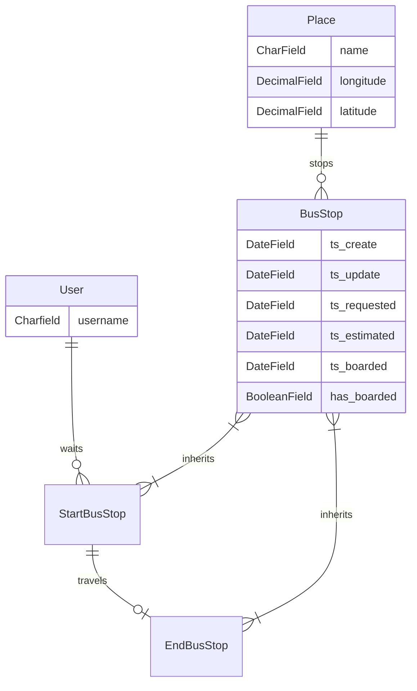

# Complete data model of the travel app

```mermaid
erDiagram
    User||--o{ StartBusStop: waits
    User {
        Charfield username
    }
    Place||--o{ BusStop: stops
    Place {
        CharField name
        DecimalField longitude
        DecimalField latitude
    }
    BusStop}|--|{ StartBusStop: inherits
    BusStop}|--|{ EndBusStop: inherits
    BusStop{
        DateField ts_create
        DateField ts_update
        DateField ts_requested
        DateField ts_estimated
        DateField ts_boarded
        BooleanField has_boarded
    }
    StartBusStop||--o| EndBusStop: travels
    StartBusStop {
    }
    EndBusStop {
    }
```